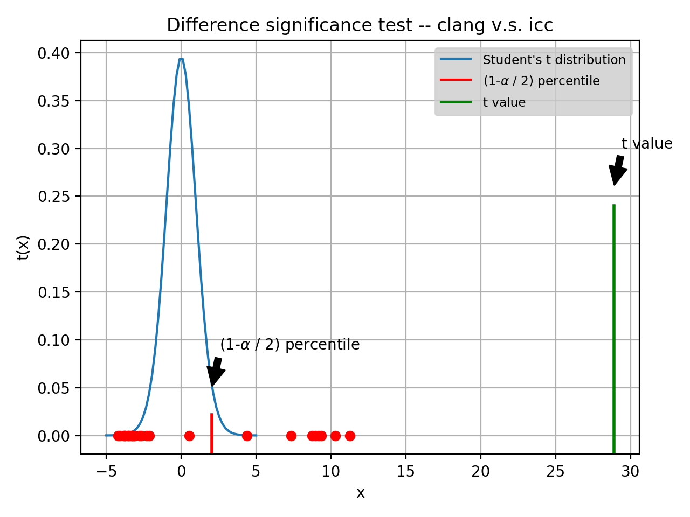

# Project: Comparaison des performances de codes de calculs scientifiques : C++ versus Java

Project Address: http://i3s.unice.fr/master-info/ter/TER-S2-liste-des-sujets-2020/#comparaison-des-performances-de-codes-de-calculs-scientifiques--c-versus-java

# Project Aims

- Write a library of matrix calculation codes in JAVA and C++ , then compare the performance between the two languages.

- Optimize the performance of the two codes using the compiler compilation options for C ++ and the Java options.

- Compare the advantages and disadvantages between C ++ and Java in our context.

# 1.Result

**N.B.** In macOs, `gcc` is actually an alias of `clang`

**N.B.** compiler optimization command `-O3`


```shell
gcc -v
# Apple LLVM version 10.0.0 (clang-1000.10.44.4)
```

<br>

## 1.1.Benchmark


<br>

**Descriptive Statistic:**

<table border="1" class="dataframe">   <thead>     <tr style="text-align: right;">       <th></th>       <th>javac</th>       <th>icc</th>       <th>gcc</th>       <th>clang</th>     </tr>   </thead>   <tbody>     <tr>       <th>count</th>       <td>30</td>       <td>30</td>       <td>30</td>       <td>30</td>     </tr>     <tr>       <th>mean</th>       <td>2.647849e+06</td>       <td>91050.466667</td>       <td>1.350425e+06</td>       <td>1.363134e+06</td>     </tr>     <tr>       <th>std</th>       <td>2.516567e+05</td>       <td>1610.367954</td>       <td>2.191578e+05</td>       <td>2.412591e+05</td>     </tr>     <tr>       <th>min</th>       <td>2.392300e+06</td>       <td>89532.000000</td>       <td>1.169918e+06</td>       <td>1.176110e+06</td>     </tr>     <tr>       <th>25%</th>       <td>2.438013e+06</td>       <td>90071.000000</td>       <td>1.209971e+06</td>       <td>1.207819e+06</td>     </tr>     <tr>       <th>50%</th>       <td>2.501972e+06</td>       <td>90508.000000</td>       <td>1.247540e+06</td>       <td>1.224052e+06</td>     </tr>     <tr>       <th>75%</th>       <td>2.941425e+06</td>       <td>90984.500000</td>       <td>1.377385e+06</td>       <td>1.515779e+06</td>     </tr>     <tr>       <th>max</th>       <td>3.014784e+06</td>       <td>95405.000000</td>       <td>1.816822e+06</td>       <td>1.857758e+06</td>     </tr>   </tbody> </table>

Conclusion: ICC is significantly faster than any other C++/C compilers. In addition, javac is slightly slower than clang and gcc.

<br>

## 1.2.Statistical inference


```shell
# Hypothesis 0: compiler javac is faster or equal to compiler clang, 
# Hypothesis 1: compiler javac is slower than compiler clang
# P value is 3.506278805348268e-28, t value is 20.184278751155123
# REJECT the null hypothesis
```
compiler javac is statistically slower than compiler clang.




```shell
# Hypothesis 0: compiler clang is faster or equal to compiler icc, 
# Hypothesis 1: compiler clang is slower than compiler icc
# P value is 3.192635833955381e-23, t value is 28.879032974213615
# REJECT the null hypothesis
```
compiler clang is statistically slower than compiler icc.


# Usage

```shell
python build.py [-h] [-n NLOOP] [-d] [-s] [-jp]
```

Run benchmark with 30 loops(it saves benchmark logs in dir `data/`), and save benchmark/analysis pictures
```shell
python build.py -n 30 -s
```

Do visualization and statistical analysis only(data obtained from benchmark logs)
```shell
python build.py -js
```

Do visualization and statistical analysis only(data obtained from benchmark logs), and save benchmark/analysis pictures
```shell
python build.py -js -s
```
