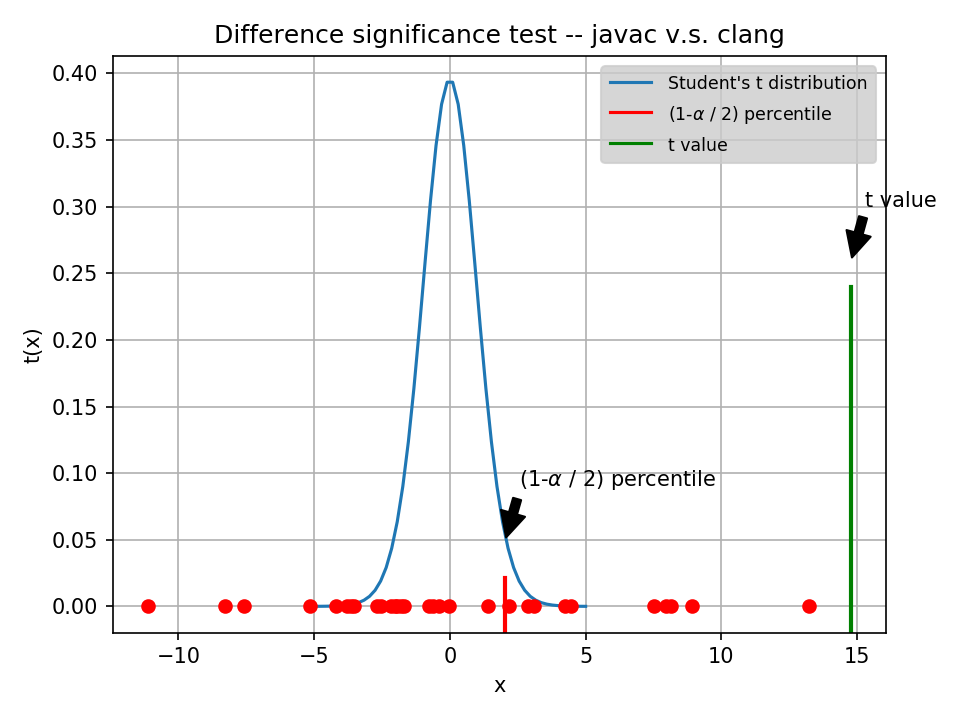

<!--
 * @Author: Lin Sinan
 * @Github: https://github.com/linsinan1995
 * @Email: mynameisxiaou@gmail.com
 * @LastEditors: Lin Sinan
 * @Description: 
*               
*               
*               
 -->

# Project: Comparaison des performances de codes de calculs scientifiques : C++ versus Java

Project Address: http://i3s.unice.fr/master-info/ter/TER-S2-liste-des-sujets-2020/#comparaison-des-performances-de-codes-de-calculs-scientifiques--c-versus-java

# Project Aims

- Write a library of matrix calculation codes in JAVA and C++, then compare the performance between the two languages.

- Optimize the performance of the two codes using the compiler compilation options for C ++ and the Java options.

- Compare the advantages and disadvantages between C ++ and Java in our context.

# Environment

## macOS

```
macOS High Sierra(10.13.6)
2.7 GHz Intel Core i5
8 GB 1867 MHz DDR3
```

compilers:
```shell
clang -v
# Apple LLVM version 10.0.0 (clang-1000.10.44.4)
gcc-8 -v
# gcc version 8.3.0 (Homebrew GCC 8.3.0_2) 
icc -v
# icc version 19.1.0.166 (gcc version 4.9.0 compatibility)
javac -version
# javac 1.8.0_231
```
## Ubuntu

```
Ubuntu 18.04.2 LTS
Intel(R) Core(TM) i7-7700HQ CPU @ 2.80GHz
16GiB 2400MHz DDR4
```

compilers:
```shell
clang -v
# clang version 6.0.0-1ubuntu2
gcc -v
# gcc version 5.5.0 20171010 (Ubuntu 5.5.0-12ubuntu1) 
icc -v
# icc version 19.1.0.166 (gcc version 5.5.0 compatibility)
javac -version
# javac 11.0.6
```


# Notice

- Caches info

the matrix size (1200 x 1000) satisfies the requirement(choisissez une taille de matrice qui a au minimum le double de la capacité du plus grand cache de votre machine)
```shell
sysctl -a | grep cachesize
# hw.cachesize: 8589934592 32768 262144 3145728 0 0 0 0 0 0
# hw.l1icachesize: 32768
# hw.l1dcachesize: 32768
# hw.l2cachesize: 262144
# hw.l3cachesize: 3145728
```

for ubuntu, the matrix size is 2000  X 3000 in this experiment.
```shell
lscpu | grep cache
# L1d cache:     32K
# L1i cache:       32K
# L2 cache:        256K
# L3 cache:        6144K
```

- In macOs, gcc is actually an alias of clang. For using gcc, we should run `brew install gcc`, and then `gcc-8` is the gcc compiler for macOS.

```shell
gcc -v
```

- compiler optimization command `-xc++ -lstdc++ -std=c++17 -O3`. `-xc++ -lstdc++` is for compilers to find headers/libs of c++


<br>

# 2.Lab

## 2.1.Performance benchmark for different compilers(language)


<br>

**Descriptive Statistic:**

<table class="dataframe">   <thead>     <tr style="text-align: right;">       <th></th>       <th>javac</th>       <th>clang</th>       <th>gcc-8</th>       <th>icc</th>     </tr>   </thead>   <tbody>     <tr>       <th>count</th>       <td>30</td>       <td>30</td>       <td>30</td>       <td>30</td>     </tr>     <tr>       <th>mean</th>       <td>2.816527e+06</td>       <td>1.572524e+06</td>       <td>7.579095e+05</td>       <td>96093.284000</td>     </tr>     <tr>       <th>std</th>       <td>3.915856e+05</td>       <td>2.429907e+05</td>       <td>1.118052e+05</td>       <td>6344.973166</td>     </tr>     <tr>       <th>min</th>       <td>2.404870e+06</td>       <td>1.192831e+06</td>       <td>5.837340e+05</td>       <td>90209.344000</td>     </tr>     <tr>       <th>25%</th>       <td>2.545310e+06</td>       <td>1.394161e+06</td>       <td>6.798695e+05</td>       <td>92784.640000</td>     </tr>     <tr>       <th>50%</th>       <td>2.681755e+06</td>       <td>1.508815e+06</td>       <td>7.559750e+05</td>       <td>95469.988000</td>     </tr>     <tr>       <th>75%</th>       <td>3.029436e+06</td>       <td>1.727959e+06</td>       <td>8.034545e+05</td>       <td>96253.990000</td>     </tr>     <tr>       <th>max</th>       <td>3.880161e+06</td>       <td>2.196186e+06</td>       <td>1.038595e+06</td>       <td>124182.224000</td>     </tr>   </tbody> </table>

Conclusion: ICC is significantly faster than any other C++/C compilers. In addition, javac is slightly slower than clang and gcc.


## 2.2.Statistical inference

As for statistical inference, we use paired sample T-test. It is a tool to determine whether the mean of two samples sets is different. We use upper-tailed test, thus we can figure out which compilers/languages is slower(use more time) in terms of their executing time. 




```
Hypothesis 0: compiler javac is faster or equal to compiler clang, 
Hypothesis 1: compiler javac is slower than compiler clang
P value is 6.916342004518929e-20, t value is 14.784998576267482
REJECT the null hypothesis
```
compiler `javac` is statistically slower than compiler `clang`.


```
Hypothesis 0: compiler gcc-8 is faster or equal to compiler icc, 
Hypothesis 1: compiler gcc-8 is slower than compiler icc
P value is 1.0046413321312455e-24, t value is 32.36964265212149
REJECT the null hypothesis
```
compiler `gcc` is statistically slower than compiler `icc`.


```
Hypothesis 0: compiler clang is faster or equal to compiler gcc-8, 
Hypothesis 1: compiler clang is slower than compiler gcc-8
P value is 4.093827353265035e-20, t value is 16.681059218603064
REJECT the null hypothesis
```
compiler clang is statistically slower than compiler gcc.


# 3.Usage

## 3.1.Choose a project

Take lab1 for example

## 3.2.Modify json

modify `config.json` in `src\lab1`

e.g.change the names of compilers if necessary.

```
{
    "compilers" : ["javac", "clang", "gcc-8", "icc"],
    ...
}
```

change the names of output images. (its length should be equal to the length of `"compilers"`)

```
    "output-names": ["javac", "clang", "g++", "icc"],
```


## 3.3.Run the experiment
```shell
python build.py [--nlab] 
```

Run benchmark with 30 loops(it saves benchmark logs in dir `data/`), and save benchmark/analysis pictures
```shell
python run.py --nlab 1
```


# TO DO

Before 1st March

1. load matrix from txt & test the acc of calculation

2. complete R plot script

3. complete lab2