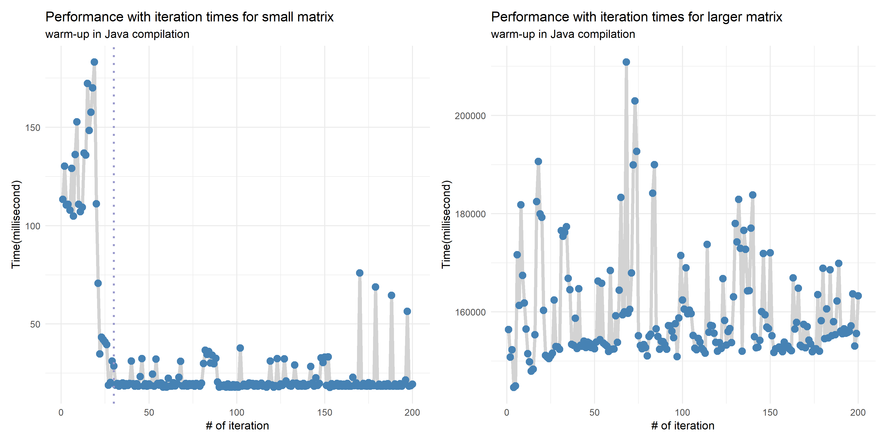
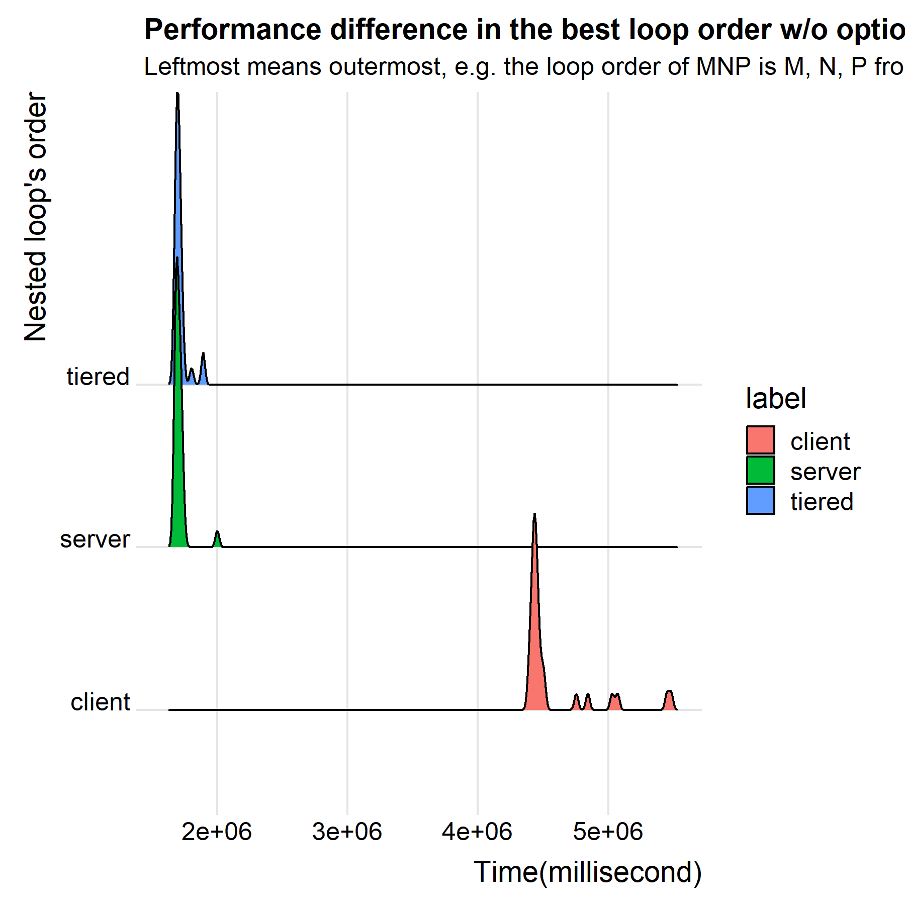
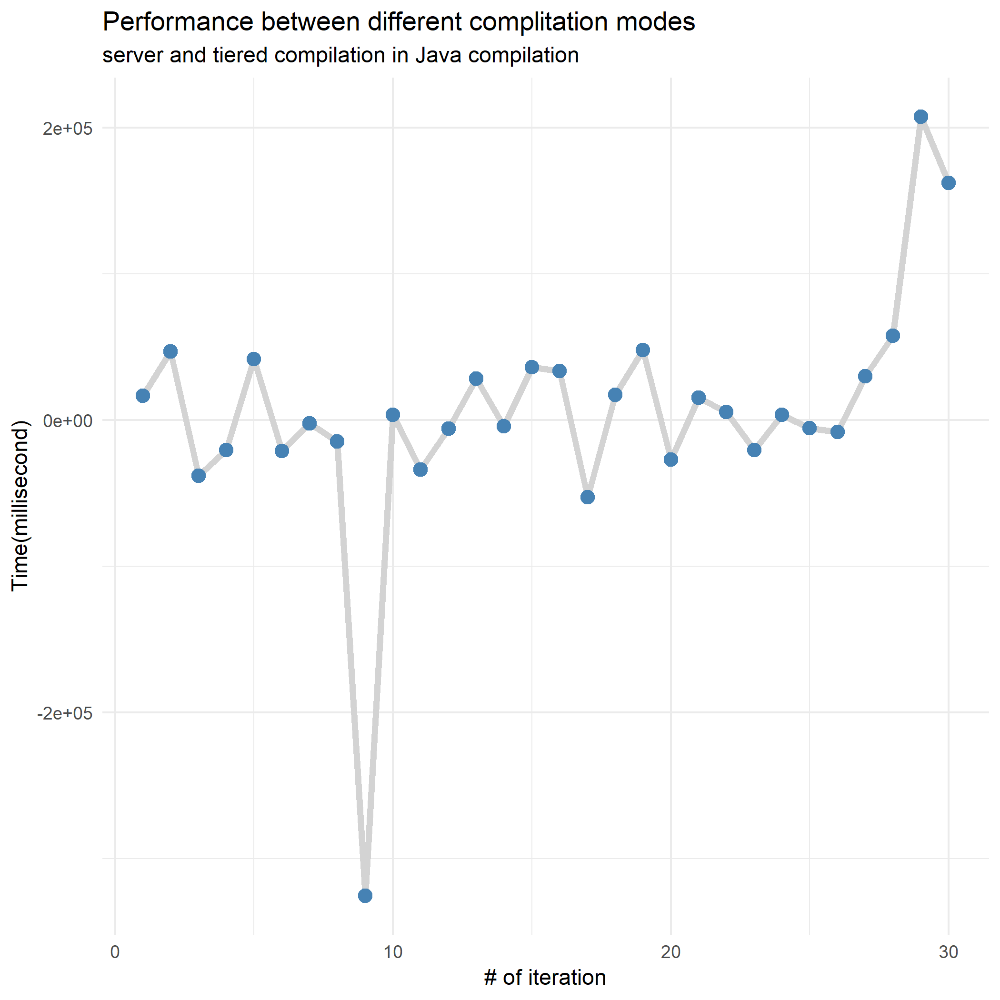

<!--
 * @Author: Lin Sinan
 * @Github: https://github.com/linsinan1995
 * @Email: mynameisxiaou@gmail.com
 * @LastEditors: Lin Sinan
 * @Description: 
*               
*               
*               
 -->

 # Lab0:  A First Look at the Java compilation

When we compile a Java code, first we need to use `javac` to convert source code into a bytecode, which makes Java VM can understand so any computer with a Java VM can interpret and run the program. In this process, 

Java compiles Java code at runtime

Warm up

Compare

